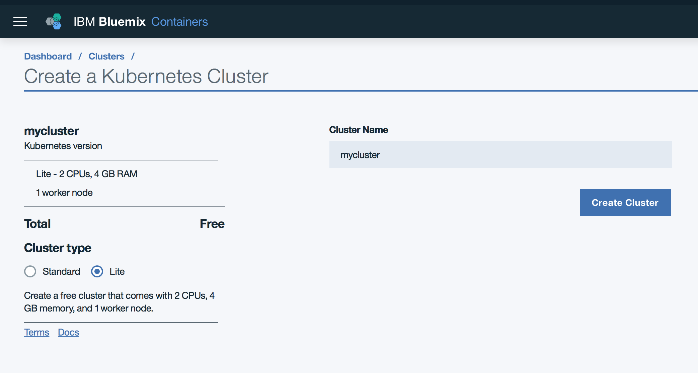
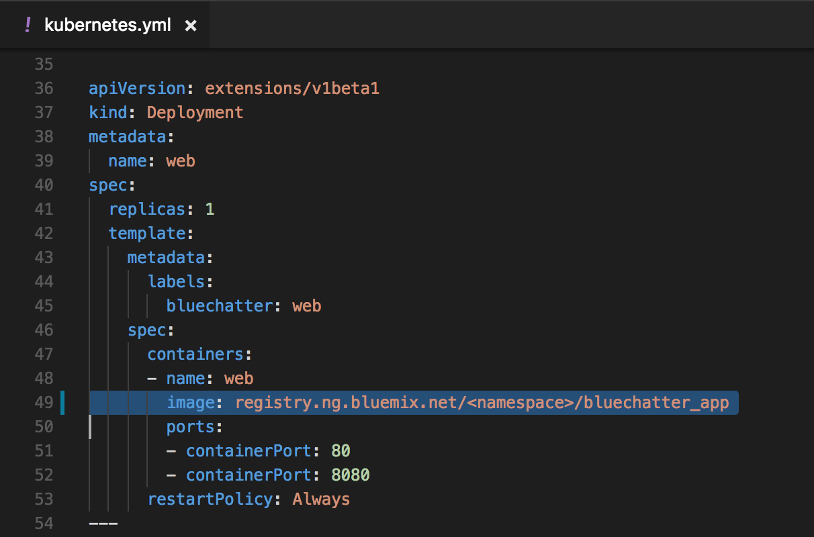
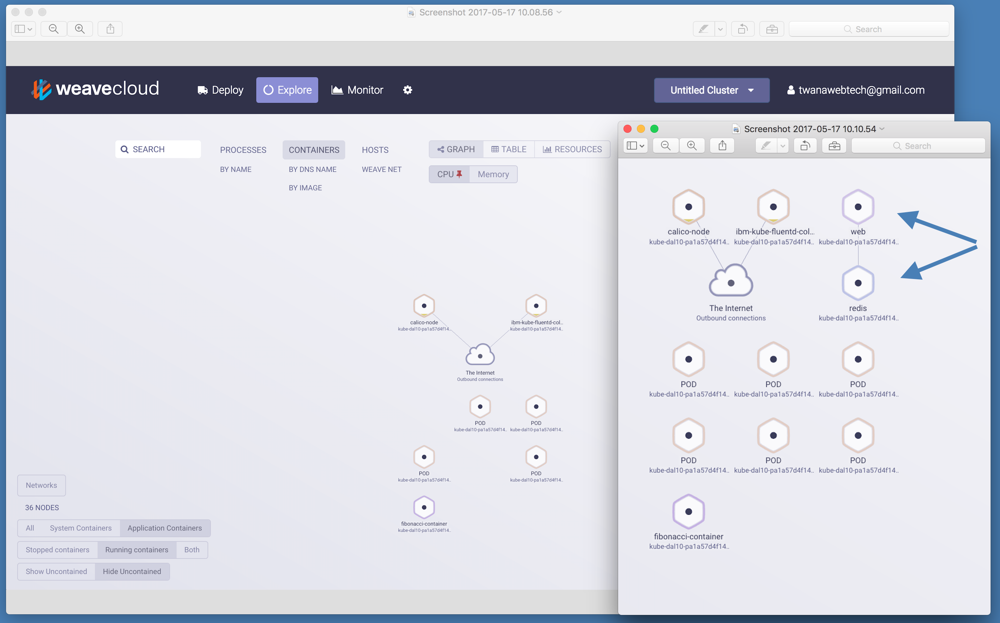
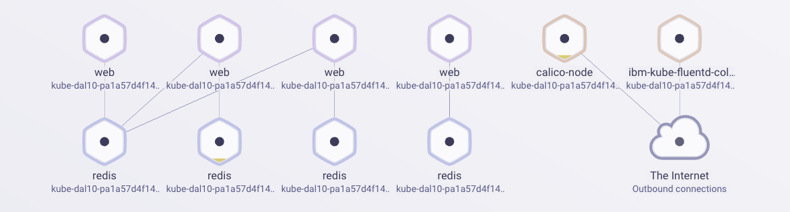
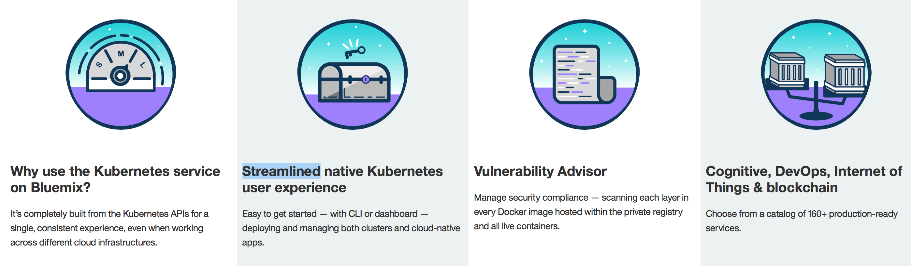

BlueChatter Overview
======================

The BlueChatter app is a simple chat/IRC type application for your browser which allows multiple users to chat when online at the same time. 
The sample app is used to showcase how to deploy and scale a chat application using Cloud Foundry and Docker container service and Kubernetes approach. 
The demo demonstrates how quickly you can deploy and scale your application where been it's a Cloud Foundry, Docker Container Service or Kubernetes Cluster. 


See how the browser chat application looks like:
  

Table of contents
=================

  * [BlueChatter Overview](#blueChatter-overview)
  * [Table of contents](#table-of-contents)
  * [Learning Objectives](#learning-objectives)
  * [Technologies Used](#technologies-used)
  * [1.0 Cloud Foundry Deployment Approach](#1-cloud-foundry-deployment-approach)
    * [1.1 Scaling Your Cloud Foundry Application](1.1-#scaling-your-cloud-foundry-application)
      * [Manual Scaling](#manual-scaling)
      * [Auto Scaling](#auto-scaling)
  * [2.0 Kubernetes Deployment Approach](#2-kubernetes-deployment-approach)
    * [2.1 Before you begin](#2_1-Before-you-begin)
    * [2.2 Create a Kubernetes cluster](#2_2-Create-a-Kubernetes-cluster)
    * [2.3 Configure kubectl and helm](#2_3-Configure-kubectl-and-helm)
    * [2.4 Build the Node.js application ](#2_4-Build-the-Node.js-application)
    * [2.5 Deploy the cluster](#2_5-deploy-the-cluster)
    * [2.6 View Cluster Graphically ](#2_6-view-cluster-graphically)
    * [2.7 Manual Scaling](#2_7-manual-scaling)
    * [2.8 Automatic Scaling](#2_8-automatic-scaling) 
    * [2.9 Why use the Kubernetes service on Bluemix?](#2_9-Why-use-the-Kubernetes-service-on-Bluemix?)
  * [Useful Kubernetes commands](#useful-kubernetes-commands)
  * [License](#license)
  * [Dependencies](#dependencies)


Learning Objectives
===================
- Learn how to deploy and scale **Cloud Foundry** application using [IBM Bluemix](https://www.ibm.com/cloud-computing/bluemix/).  
- Learn how to deploy and scale a **Kubernetes Cluster** using [IBM Bluemix Kubernetes approach](https://console.ng.bluemix.net/docs/containers/cs_ov.html#cs_ov).  
- Learn how to create a simple Chat application with NodeJs and Express.  
- Learn more on the tooling and reporting when working with Docker Containers and Kubernetes clusters. 


Technologies Used
=================

BlueChatter uses [Node.js](http://nodejs.org/) and
[Express](http://expressjs.com/) for the server.  On the frontend,
BlueChatter uses [Bootstrap](http://getbootstrap.com/) and
[Jquery](http://jquery.com/).  The interesting part of this application
is how the communication of messages is done.  The application uses [long
polling](http://en.wikipedia.org/wiki/Push_technology#Long_polling) to enable
the clients (browsers) to listen for new messages.  Once the
app loads successfully, a client then issues a request to the server.  The server waits to respond
to the request until it receives a message.  If no message is received from any
of the chat participants, it responds back to the client with a 204 - no content.
As soon as the client gets a response from the server, regardless of whether that
response contains a message or not, the client will issue another request and
the process continues.


The main goal of this application is to demonstrate the deployment and scaling of Docker container and Cloud Foundry application on [IBM Bluemix](https://www.ibm.com/cloud-computing/bluemix/). We will look at why and when you should deploy your application to a docker container over the classic Cloud Foundry root. You will learn on how to scale your application, scaling is big factor to any production applications, no matter which root you would take you would still need to scale your application for when traffic spike occur. With using the [IBM Bluemix auto scaling](https://console.ng.bluemix.net/docs/services/Auto-Scaling/index.html) service, we can automatically scale our Cloud Foundry Application or Docker Container application. To forwarder explain what scaling means, all scaling is to have multiple instance of the same application running at the same time, this means all users seen the same application while each user is directed to different instance of the application depending on the number of the instances you scale to.


Another area we should outline is how do the chat messages happen between the different servers, how do all instance of the applications talk to the same database to offer the chat experience to the users like if they are all on one instance?
For that we use the [pubsub feature of Redis](http://redis.io/topics/pubsub) to solve this. All the servers will be bound to a single Redis instance and each server is listening for messages on the same channel.
When one chat server receives a chat message it publishes an event to Redis containing the message. The other servers then get notifications of the new messages and notify their clients of the.  This design allows BlueChatter to scale nicely to meet the demand of its users.


1 Cloud Foundry Deployment Approach
=================================

1. Create a Bluemix Account  
  [Signup](https://console.ng.bluemix.net/registration/?target=%2Fdashboard%2Fapps) for Bluemix, or use an existing account.

2. Download and install the [Cloud-foundry CLI](https://github.com/cloudfoundry/cli) tool

3. If you have not already, [download node.js 6.7.0 or later][https://nodejs.org/download/] and install it on your local machine.

4. Clone the app to your local environment from your terminal using the following command
  ```
  git clone https://github.com/IBM-Bluemix/bluechatter.git
  ```

5. `cd` into the `bluechatter` folder that you cloned
  ```
  cd bluechatter
  ```

6. Edit the `manifest.yml` file and change the application `host` to something unique. The host you use will determinate your application url initially, e.g. `<host>.mybluemix.net`.

7. Connect and login to Bluemix `$ bx login -a https://api.ng.bluemix.net`
8. Target your account ORG and SPACE `bx target -o ORG -s SPACE`
9. Create a Redis service for the app to use, we will use the RedisCloud service. `$ bx cf create-service rediscloud 30mb redis-chatter`
10. Push the application `bx cf push`


**Done**, the app should be running on: `<host>.mybluemix.net`


1_1 Scaling Your Cloud Foundry Application
------------------------------------------

Since we are using Redis to send chat messages, you can scale this application as much as you would like and people can be connecting to various servers and still receive chat messages.  We will be looking on how to scale the application runtime instances for when needed, to do this we are going to look at the manual scaling command or use the Auto-Scaling service to automatically increase or decrease the number of application instances based on a policy we set it.

Manual Scaling
--------------

1. Manually scale the application to run 3 instances
  ```
  $ cf scale my-blue-chatter-app-name -i 3
  ```

2. Then check your that all your instances are up and running.
  ```
   $ cf app my-blue-chatter-app-name
  ```
  Now switch over to your staging domain(`<host>.mybluemix.net`.) to see your running application. Note, you know which instance you are connecting to in the footer of the form.
  If you have more than one instance running chances are the instance id will be different between two different browsers.

Auto Scaling
------------

- It's good to be able to manually scale your application but Manual scaling wont work for many cases, for that reason we need to setup a [Auto-Scaling](https://console.ng.bluemix.net/docs/services/Auto-Scaling/index.html) to automatically scale our application for when needed.
  To learn more on Auto-Scaling checkout the blog post [Handle the Unexpected with Bluemix Auto-Scaling](https://www.ibm.com/blogs/bluemix/2015/04/handle-unexpected-bluemix-auto-scaling/) for detailed descreption on [Auto-Scaling](https://console.ng.bluemix.net/docs/services/Auto-Scaling/index.html).


2 Kubernetes Deployment Approach
==============================
IBM Bluemix now support Kubernetes clusters within the platform, kubernetes is the future of docker applications so lets explore how to deploy the BlueChatter application as a Kubernetes cluster. 
There are few compounds that you must understand before deploying a kubernetes cluster. 

2_1 Before you begin
---------

* [Container registry with namespace configured](https://console.bluemix.net/docs/services/Registry/registry_setup_cli_namespace.html).
* [IBM Cloud Developer Tools](https://github.com/IBM-Bluemix/ibm-cloud-developer-tools) - Script to install docker, kubectl, helm, bx cli and required plugins.
* [Basic understanding of Kubernetes](https://kubernetes.io/docs/tutorials/kubernetes-basics/)


2_2 Create a Kubernetes cluster
---------

1. Create a Kubernetes cluster from the [Bluemix Catalog](https://console.bluemix.net/containers-kubernetes/launch). You will create a **free** cluster of type **Lite** and still be able to follow the guide and skip the appropriate sections. To bind a custom domain, You must create a **Paid** cluster of type **Standard**.

  **Note:** For the ease of use, Check the configuration details like Number of CPUs, Memory and Number of Worker Nodes you will be getting under Lite and Standard plans.

   

    > Note that you can also use an existing cluster

In the next step, you will configure **kubectl** to point to your newly created cluster going forward.


2_3 Configure kubectl and helm
---------

[kubectl](https://kubernetes.io/docs/user-guide/kubectl-overview/) is a a command line tool to interact with a Kubernetes cluster.

1. Use `bx login` to login interactively. Provide the Organization (Org), Region and Space under which the cluster is created. You can reconfirm the details by running `bx target` command.
2. Once the cluster is ready, retrieve the cluster configuration
   ```
   bx cs cluster-config <cluster-name>
   ```
3. Copy and paste the **export** command to set the KUBECONFIG environment variable as directed. To verify whether the KUBECONFIG environment variable is set properly or not, run this command
  `echo $KUBECONFIG`

4. Check that the `kubectl` command is correctly configured
   ```
   kubectl cluster-info
   ```
5. [Helm](https://helm.sh/) helps you manage Kubernetes applications through Helm Charts — Helm Charts helps you define, install, and upgrade even the most complex Kubernetes application. Initialize Helm in your cluster.

   ```
   helm init
   ```

2_4 Build the Node.js application 
---------

1. Clone the app to your local environment from your terminal using the following command

    ```
      git clone https://github.com/IBM-Bluemix/bluechatter.git
    ```

2. `cd` into the `bluechatter` folder that you cloned

    ```
      cd bluechatter
    ```

3. Start the Docker engine on your local computer
   > See the [Docker installation instructions](https://docs.docker.com/engine/installation/) if you don't yet have the Docker engine installed locally or need help in starting it.

4. Log the local Docker client in to IBM Bluemix Container Registry:

   ```
   bx cr login
   ```

   > This will configure your local Docker client with the right credentials to be able to push images to the Bluemix Container Registry.

5. Retrieve the name of the namespace you are going to use to push your Docker images:

   ```
   bx cr namespace-list
   ```

   > If you don't have a namespace, you can create one with `bx cr namespace-create mynamespace` as example.

6. Check that you have installed **Container Registry plugin** and **Container Service plugin** with this command
    ```
    bx plugin list
    ```
    > Output:   
          listing installed plug-ins...  
          Plugin Name          Version   
          schematics           1.2.0   
          sdk-gen              0.1.3   
          Cloud-Functions      1.0.2   
          container-registry   0.1.215   
          container-service    0.1.328   
          dev                  1.0.4    

7. Modify the kubernetes.yml with replacing the **namespace** with your namespace.   


8. Build the Docker image of the service

   > In the following steps, make sure to replace `<namespace>` with your namespace name.

   ```
   docker build -t registry.ng.bluemix.net/<namespace>/bluechatter_app:latest .   
   ```

9. Push the image to the registry

   ```
   docker push registry.ng.bluemix.net/<namespace>/bluechatter_app:latest
   ```


2_5 Deploy the cluster
---------

> Before deploying the cluster, make sure the steps above are complete and the cluster state is READY

1. Retrieve the cluster configuration

   ```
   bx cs cluster-config <cluster-name>
   ```

   The output will look like:

   ```
   Downloading cluster config for mycluster
   OK
   The configuration for mycluster was downloaded successfully. Export environment variables to start using Kubernetes.

   export KUBECONFIG=/Users/Twana/.bluemix/plugins/container-service/clusters/mycluster/kube-config-prod-dal10-mycluster.yml
   ```

2. Copy and paste the `export KUBECONFIG=...` line into your shell.

3. Confirm the configuration worked by retrieving the cluster nodes:

   ```
   kubectl get nodes
   ```
   > Output:  
   > NAME             STATUS    AGE  
   > 10.44.103.74    Ready     2m  

4. Deploy the BlueChatter application to the cluster
  ```
    kubectl create -f kubernetes.yml
  ```
   > Output:  
   > deployment "redis" created
   > service "redis" created
   > deployment "web" created
   > service "web" created

5. Wait a few minutes for your application to be deployed.

6. Retrieve the **public IP** of your cluster workers.
   ```
   bx cs workers <your-cluster>
   ```
   
   ```
   OK
   ID                                                 Public IP        Private IP      Machine Type   State    Status
   kube-hou02-pa95994f682be3443fbc92959175674f84-w1   173.193.85.219   10.44.103.74   u1c.2x4        normal   Ready
   ```
7. Retrieve the **port** assigned to your application.
   ```
   kubectl get services
   ```
   and locate your service in the list:
   ```
   NAME  		CLUSTER-IP    		EXTERNAL-IP   PORT(S)			AGE
   web   		172.21.220.28   	<nodes>       80:30089/TCP   	2m
   kubernetes	10.10.10.1    		<none>        443/TCP      		5m
   redis		None    			<none>        55555/TCP      	5m
   ```
   {: screen}
   alternatively you can use `kubectl describe service [service-name]`. In this example, the port is 30089.

8. Access the application
   `http://worker-ip-address:portnumber`

   **Example:** http://173.193.85.219:30089

2_6 View Cluster Graphically 
-------------------------------------------
1. To view the clusters graphically we are going to use **Cloud**weave to see graphically the different pods and overall cluster setup. 

    Sign up for a free **Cloud**weave account: https://cloud.weave.works/signup and follow the steps to create your account. 

2. Click on the "Explore" option and run the commands provided by **Cloud**weave to connect to your cluster. This should be something like this:
    ```
    kubectl apply -n kube-system -f \
       "https://cloud.weave.works/k8s/scope.yaml?service-token=<TOEKN-XXXXXXXXXXXXXXXXXXX>-version=$(kubectl version | base64 | tr -d '\n')"
    ```

    Once **Cloud**weave is setup you then should see your cluster pods graphically. 
    In the screenshots below you can see the BlueChatter Web and Redis pods created on the right.
    

3. **Additionally** we can also view logs locally if you don't like using the graphical tool, a tool like kubetail can be used to tail the logs of multiple pods https://github.com/johanhaleby/kubetail. Once installed you can do kutetail fibo to watch the logs.


2_7 Manual Scaling 
------------------
1. First, run a command to see the number of running pods, we should see one pod for the *redis service* and one pod for the *web application*.
    ```
    kubectl get pods    
    ```
2. Scale from 1 to 4 replicas, note in the kubernetes.yml we have set to have 1 replicas so with this command we tell it to have 4 replicas.
    ```
    kubectl scale --replicas=4 -f kubernetes.yml
    ```
    

3. Scale back down to 1 replica 
    ```
    kubectl scale --replicas=1 -f kubernetes.yml
    ```

2_8 Automatic Scaling
---------------------
1. Configure the automatic scaling for Kubernetes
    ```
    kubectl autoscale -f kubernetes.yml --cpu-percent=10 --min=1 --max=10
    ```
    This tells Kubernetes to maintain an average of 10% CPU usage over all pods in our deployment and to create at most 10 pod replicas.

    In order to see Auto Scaling in action, we would need to drive some traffic to the BlueChatter app in order to see the application scaling. You can use something like [Apache JMeter](http://jmeter.apache.org/) to drive traffic to the application, in this demo we will not cover [Apache JMeter](http://jmeter.apache.org/) given that there are many tutorials covering [Apache JMeter](http://jmeter.apache.org/).

2. Use this command to see the Auto Scaling been setup 
    ```
    kubectl get hpa
    ```
    > Output: 
    ```
    NAME      REFERENCE          TARGET    CURRENT     MINPODS   MAXPODS   AGE
    redis     Deployment/redis   10%       <waiting>   1         10        14m
    web       Deployment/web     10%       <waiting>   1         10        14m
    ```
3. Remove the hpa
    ```
    kubectl delete hpa redis
    kubectl delete hpa web
    ```

4. Scale back to down to 1 replica
    ```
    kubectl scale --replicas=1 -f kubernetes.yml
    ```

2_9 Why use the Kubernetes service on Bluemix?
----------------------------------------------
 

For more details, visit [IBM Bluemix Container Service](https://www.ibm.com/cloud-computing/bluemix/containers)


**Done!**    


Useful Kubernetes commands
===========================
1. Get services, pods and deployments 
   ```
   kubectl get service
   kubectl get pods
   kubectl get deployments 
   ```

2. Delete services, pods and deployments 
    ```
    kubectl delete service <service-name>
    kubectl delete pods <pod-name>
    kubectl delete deployments <deployments-name>
    ``
    ```

3. Get cluster node IP Address and state
   ```
   bx cs workers mycluster
   ```

4. Get the port (NodePort)
    ```
    kubectl describe service web
    ```

Additional Links
=======
For additional information about on IBM Containers see the the following links:  
[Bluemix documentation](https://console.ng.bluemix.net/docs/containers/container_index.html)  
[Docker user manual PDF](https://github.com/IBM-Bluemix/bluechatter/blob/master/ReadMeImages/docker.PDF)   
[Deploy Kubernetes cluster to Bluemix](https://console.ng.bluemix.net/docs/containers/cs_apps.html#cs_apps)

License
=======
This code is licensed under Apache v2.  See the LICENSE file in the root of the repository.

Dependencies
============

For a list of 3rd party dependencies that are used see the package.json file in the root of the repository.
